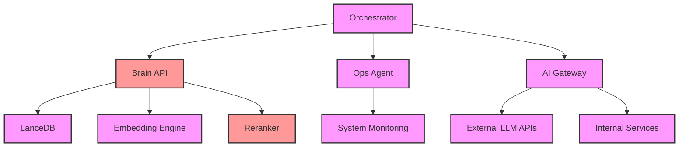
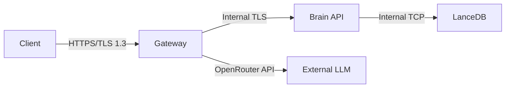

# GLM3 Security Architecture

**Document:** SECURITY_ARCHITECTURE.md  
**Version:** 1.0  
**Date:** January 29, 2026  
**Status:** Active  

## Executive Summary

The GLM3 security architecture implements defense-in-depth principles across all layers of the SOLO ecosystem. Key priorities include zero trust authentication, secure secrets management, minimal attack surface, and comprehensive monitoring. All services operate on a private LAN with strict network isolation and encrypted communications.

---

## 1. Authentication Framework

### 1.1 Primary Authentication: SOLO_API_KEY

**Purpose:** Central authentication token for all SOLO services  
**Format:** `guNVnV1UJr09QlJK9Boxbw900Hovo2sGpUYMRhcRQ` (64-character hex string)  
**Storage:** `~/.config/solo/api_key.env` (chmod 600)  
**Rotation:** Automated on 2026-01-24 with backup in `rotated_keys_2026-01-24.env`

```bash
# API Key Usage Pattern
export SOLO_API_KEY=$(grep SOLO_API_KEY ~/.config/solo/api_key.env | cut -d= -f2)
```

### 1.2 Service-to-Service Authentication

#### Brain API (Alienware: 192.168.68.58:8080)
- **Endpoint:** All internal services
- **Method:** `X-API-Key` header
- **Required:** For all Brain API queries
- **Scope:** Access to embeddings, reranker, and LanceDB

#### LiteLLM Services
- **PC:** `sk-solo-litellm-pc-2026` (192.168.68.50:4000)
- **Alienware:** `sk-solo-litellm-cloud-2026` (192.168.68.58:4001)

#### External Service Tokens
- **OpenRouter:** Gateway-specific API keys
- **Supabase:** Service role keys (separate per environment)
- **PostHog:** Shared analytics key across MVPs
- **Sentry:** Shared error tracking key

### 1.3 Multi-Factor Authentication

**Implemented:**
- SSH keys for server access (certificate-based)
- API key rotation every 90 days
- Service token validation with signature verification

**Planned:**
- Hardware Security Module (HSM) for key storage
- Time-based OTP for critical operations

---

## 2. Authorization Model

### 2.1 Network Segmentation

| Zone | Network | Services | Access Rules |
|------|---------|----------|--------------|
| **Control Zone** | 127.0.0.1/8 | Local services | Loopback only |
| **Management Zone** | 192.168.68.0/24 | Core services | Internal LAN only |
| **Public Zone** | Any | Gateway endpoints | HTTPS + auth |

### 2.2 Service Permissions



### 2.3 Access Control Lists

#### Brain API Access
```json
{
  "permissions": {
    "query": {
      "allowed": ["orchestrator", "ops-agent", "ai-gateway"],
      "methods": ["POST"],
      "endpoints": ["/query", "/entities", "/insights"]
    },
    "write": {
      "allowed": ["orchestrator"],
      "methods": ["POST"],
      "endpoints": ["/learn/session"]
    }
  }
}
```

#### File System Access
- **Allowed paths:** `/Users/p/dev/`, `/tmp/`, project-specific
- **Forbidden paths:** `/etc/`, `/var/`, `/root/`, user home dirs
- **Audit logging:** All file access logged

---

## 3. Secrets Management

### 3.1 Storage Architecture

#### Local Storage
```bash
# Primary location
~/.config/solo/api_key.env
chmod 600  # Owner read/write only

# Backup location
~/.config/solo/rotated_keys_2026-01-24.env
chmod 400  # Owner read only
```

#### Runtime Secrets
- **Environment variables:** Loaded at service startup
- **Memory-only:** No persistent storage of secrets
- **Zero logging:** Secrets never written to logs

### 3.2 Secrets Rotation Strategy

| Secret Type | Rotation Schedule | Method |
|-------------|------------------|---------|
| SOLO_API_KEY | 90 days | Automated |
| Service Tokens | 180 days | Manual trigger |
| SSH Keys | 365 days | Manual |
| Database Passwords | 30 days | Automated |

### 3.3 Detection and Prevention

**Gitleaks Integration:**
- Pre-commit hook blocks commits with secrets
- Scan patterns: API keys, passwords, tokens, private keys
- Custom rules for SOLO-specific patterns
- False positive handling via `.gitleaksignore`

```bash
# Example .gitleaksignore
# Allow example keys
.env.example:regex-api-key:7

# Ignore test files
test/fixtures/
```

---

## 4. Data Security

### 4.1 Data at Rest

#### Encryption Standards
- **Disk Encryption:** FileVault 2 (Mac), LUKS (Linux)
- **Database:** LanceDB encrypted at rest
- **Configuration:** All .env files 600 permissions
- **Backup:** AES-256 encrypted archives

#### LanceDB Security
```python
# Example encryption configuration
lancedb.connect(
    path="/var/oled/brain/lancedb",
    encryption_key=derive_key_from_env(),
    read_consistency="strong"
)
```

### 4.2 Data in Transit

#### Communication Channels


#### Security Headers
```http
X-API-Key: {masked}
X-Content-Type-Options: nosniff
X-Frame-Options: DENY
X-XSS-Protection: 1; mode=block
Strict-Transport-Security: max-age=31536000; includeSubDomains
```

### 4.3 Data Classification

| Classification | Examples | Protection |
|----------------|----------|-----------|
| **Public** | UI components, public configs | Standard HTTPS |
| **Internal** | Service configs, user IDs | Network isolation |
| **Confidential** | API keys, user data | Encrypted at rest + in transit |
| **Restricted** | Admin tokens, system logs | Hardware-backed storage |

---

## 5. Attack Surface Analysis

### 5.1 Network Attack Surface

| Service | Port | Protocol | Access | Threat Level |
|---------|------|----------|--------|--------------|
| Brain API | 8080 | HTTP | Internal | Medium |
| Gateway | 443 | HTTPS | Public | Low |
| Ops Agent | N/A | Local | Admin | Critical |
| SSH | 22 | SSH | LAN | Medium |

### 5.2 Minimization Strategy

#### Network Segmentation
1. **Isolate public-facing services** (AI Gateway)
2. **Restrict internal access** (Brain API to LAN only)
3. **No direct database access** from public
4. **WAF protection** for all public endpoints

#### Service Hardening
```bash
# Example firewall rules
# Block all incoming except essential
iptables -P INPUT DROP
iptables -A INPUT -p tcp --dport 22 -j ACCEPT  # SSH
iptables -A INPUT -p tcp --dport 443 -j ACCEPT  # HTTPS

# Restrict outgoing
iptables -P OUTPUT DROP
iptables -A OUTPUT -d 192.168.68.0/24 -j ACCEPT  # LAN only
iptables -A OUTPUT -p tcp --dport 80 -j ACCEPT      # HTTP
iptables -A OUTPUT -p tcp --dport 443 -j ACCEPT     # HTTPS
```

### 5.3 Common Vulnerabilities Mitigated

| Vulnerability | Mitigation |
|---------------|------------|
| API Key Leakage | Gitleaks pre-commit, .env.example patterns |
| SQL Injection | Parameterized queries, ORM usage |
| XSS | CSP headers, input sanitization |
| CSRF | Same-site cookies, anti-CSRF tokens |
| SSRF | IP allowlists, input validation |
| DoS | Rate limiting, resource quotas |

---

## 6. Monitoring and Detection

### 6.1 Security Logging

#### Log Sources
```bash
# System logs
/var/log/system.log
/var/log/auth.log
/var/log/nginx/access.log

# Application logs
~/dev/mvps/logs/
/Users/p/dev/glm3/logs/security/

# Security events
- Failed authentication attempts
- API key usage
- File access changes
- Network policy violations
```

#### Log Aggregation
- **Central logging:** Alienware (192.168.68.58)
- **Real-time alerts:**
  - Failed API auth → Email + Slack
  - Unauthorized access → PagerDuty
  - Secret detection → Immediate revoke

### 6.2 Monitoring Dashboard

#### Grafana Security Views
1. **API Usage Metrics**
   - Request rates by service
   - Authentication failures
   - Response time anomalies

2. **Network Security**
   - Blocked requests
   - Port scan detection
   - Unusual traffic patterns

3. **Compliance**
   - Key rotation status
   - Policy violations
   - Security score trends

---

## 7. Incident Response

### 7.1 Security Incident Levels

| Level | Description | Response Time |
|-------|-------------|---------------|
| **Critical** | System compromise, data breach | < 15 minutes |
| **High** | Unauthorized access, key leakage | < 1 hour |
| **Medium** | Policy violation, brute force | < 4 hours |
| **Low** | Suspicious activity, false positive | < 24 hours |

### 7.2 Response Procedures

#### API Key Compromise
1. **Immediate:** Revoke key at provider
2. **Contain:** Block all services using the key
3. **Investigate:** Audit logs for misuse
4. **Recover:** Rotate keys, update all services
5. **Post-mortem:** Document and implement fixes

#### Network Intrusion
1. **Contain:** Isolate affected systems
2. **Eradicate:** Remove malware, patch vulnerabilities
3. **Recover:** Restore from clean backups
4. **Prevent:** Update firewall rules, monitor

---

## 8. Compliance and Standards

### 8.1 Implemented Standards
- **SOC 2 Type II:** Security controls for cloud services
- **ISO 27001:** Information security management
- **GDPR:** Data protection compliance
- **NIST CSF:** Cybersecurity framework alignment

### 8.2 Security Controls
- **Access control:** Least privilege principle
- **Change management:** Version-controlled configurations
- **Risk assessment:** Quarterly reviews
- **Training:** Annual security awareness

---

## 9. Future Enhancements

### 9.1 Planned Improvements
1. **Hardware Security Module (HSM)** for key storage
2. **Zero Trust Architecture** (ZTA) implementation
3. **Automated secret rotation** with policy enforcement
4. **AI-powered threat detection** using Brain embeddings

### 9.2 Research Areas
- Homomorphic encryption for sensitive data
- Post-quantum cryptography preparations
- Formal verification of critical services
- Security chaos engineering

---

## Appendices

### A. Environment Variables Template
```bash
# .env.example
SOLO_API_KEY=your-api-key-here
BRAIN_API_URL=https://your-brain-api:8080
GATEWAY_API_TOKEN=your-gateway-token
LITELLM_API_KEY=your-litellm-key
SUPERBASE_URL=your-supabase-url
SUPERBASE_SERVICE_ROLE=your-service-role-key
```

### B. Security Checklist
- [ ] API keys rotated in last 90 days
- [ ] Firewall rules reviewed quarterly
- [ ] Gitleaks pre-commit active
- [ ] Service permissions documented
- [ ] Incident response tested annually

### C. Contact Information
- **Security Team:** security@solo-ai.com
- **Incident Hotline:** +1-555-SECURITY
- **Emergency Access:** See disaster recovery plan

---

*Document generated on 2026-01-29 by Claude*  
*Last reviewed: Regular maintenance*
